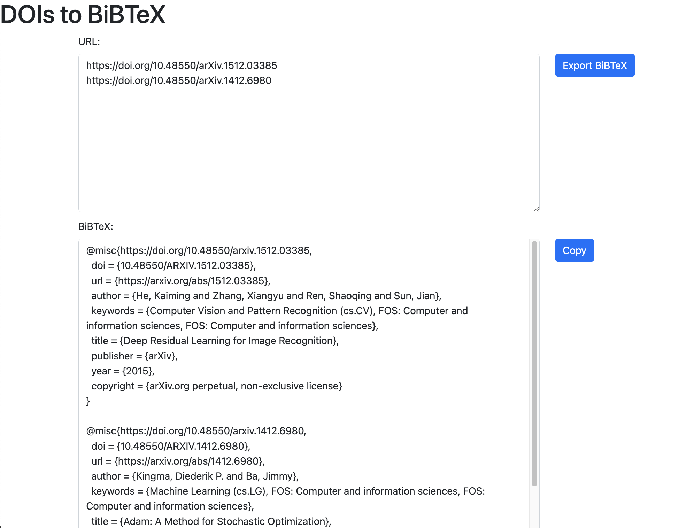

# dois2bib
複数の論文URL(https://doi.org/DOIコード) からBiBTeXを出力します。


## インストール
```
git clone https://github.com/seiya8/dois2bib.git && cd dois2bib
bundle install --path .bundle
```

## 起動
一応Basic認証を入れているので、引数でusernameとpasswordを指定します。
```
bundle exec ruby dois2bib.rb username password
```
https://localhost:4567 にアクセスして起動時に指定したusernameとpasswordを入れると開きます。
